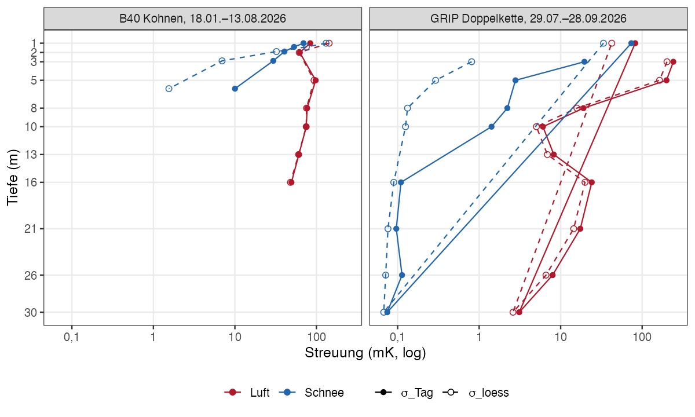
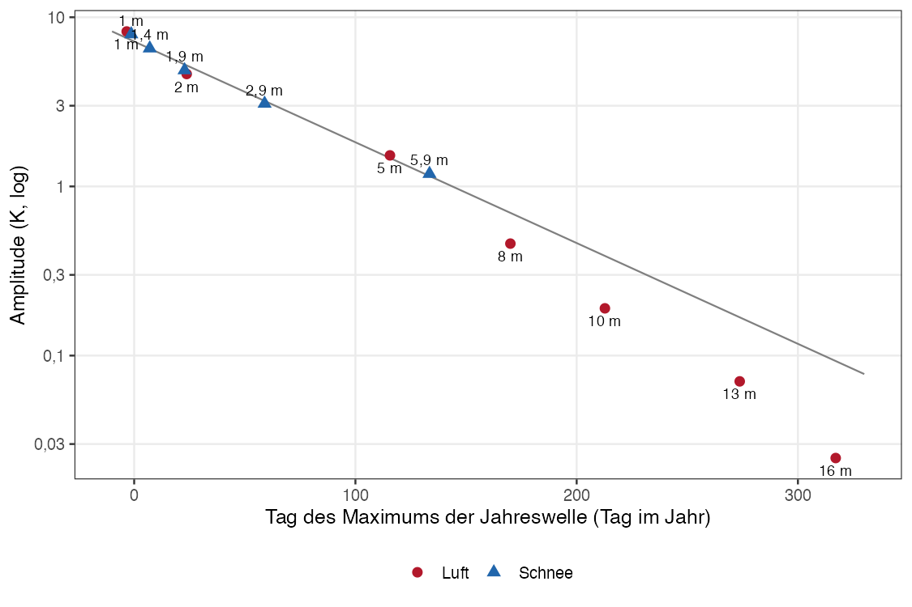
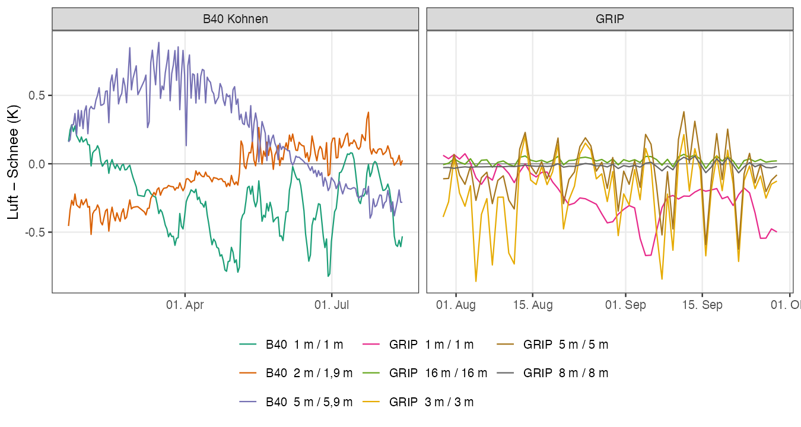

# B40 (Kohnen): flache 10-m-Kette im Schnee gegen die oberen Sensoren der 200-m-Kette im offenen Bohrloch, verglichen mit dem GRIP-Doppelketten-Experiment

Stand 06.10.2026, Thomas Laepple (AWI). Analyse: `EncoderHeads2026/KohnenRecords_Analyse/analysen/2026-10-06_b40_flachkette_vs_luftloch/` (`vergleich_b40_grip.R`; Angleichfenster `pruefung_angleichfenster.R`; Systematik `systematik_jahreswelle.R`, `systematik_differenzen.R`; Abbildungen `abbildungen.R`).

## Aufbau und Daten

**B40 (head04, Modem 231710).** Zwei Ketten am selben Kopf: die Bohrlochkette n1–n20 im offenen, luftgefüllten Loch (Ø 12 cm, gebohrt 2013, 1–201 m; oberste Knoten bei 1, 2, 5, 8, 10, 13, 16 m) und eine flache 10-m-Kette n21–n25 im Schnee (nominal 1 / 1,4 / 1,9 / 2,9 / 5,9 m; Tiefen aus der Kalibrierdatei, nicht eingemessen). Ein Profil pro Tag (17:38 UTC), Record 18.01.–13.08.2026, 203 Profile. Kalibrierung: Lab-S4 pro Sensor (2023).

**GRIP Doppelkette (IMEI 301434062008130).** Zwei Ketten mit identischer Tiefenbelegung (1/3/5/8/10/13/16/21/26/30 m) in zwei frisch gebohrten Löchern 10 m voneinander entfernt, eingebaut 08.07.2026: Kette 1 im offenen Luftloch, Kette 2 schneeverfüllt. Ein Profil pro Tag (15:13 UTC). Ausgewertet ab 29.07. (drei Wochen nach Einbau) bis 28.09.2026, 62 Profile. Kalibrierung: universelle Mean-S4-Kurve.

**Metrik.** Tag-zu-Tag-Streuung σ_Tag = sd(T(t+1 d) − T(t)) / √2 je Knoten, wie im GRIP-Dokument. Über einen Record mit Jahresgang enthält σ_Tag auch die Änderung der saisonalen Rate (an B40 bei 5,9 m im Schnee von +22 mK/Tag im Februar auf −14 mK/Tag im Juli); für die Schneekette wird deshalb zusätzlich das Residuum um einen glatten Verlauf angegeben (σ_loess, loess mit span 0,2). Das Instrumentenniveau gibt das Replikat-Rauschen der beiden Thermistoren desselben Knotens, sd(NTC1 − NTC2) / √2. Die Streuung einer Zeitreihe um sich selbst ist unabhängig von Kalibrieroffsets; die Mitteldifferenz zweier Knoten ist es nicht.

**Angleichfenster.** Der B40-Record beginnt am 18.01.2026 mit der Übertragung; ein Einbautransient der Schneekette ist nicht zu sehen: In den ersten 30 Tagen ist σ_Tag der Schneekette am kleinsten im Record (5,9 m 1,2 mK, 2,9 m 7,8 mK), die Wochenmittel bei 5,9 m steigen von der ersten Woche an gleichförmig mit 0,14 K/Woche (ankommende Sommerwelle), ohne Knick. Ohne die ersten 30 bzw. 60 Tage ändern sich die Zahlen der Luftkette um weniger als 10 %, die der Schneekette bei 2,9 m von 30 auf 19 bzw. 14 mK (saisonaler Ratenanteil). Die Ergebnisse unten beziehen sich auf den ganzen Record.

## B40: Tag-zu-Tag-Streuung Luft gegen Schnee

Ganzer Record, in mK:

| Tiefe | Luft σ_Tag | Luft σ_loess | Schnee σ_Tag | Schnee σ_loess | Verhältnis σ_Tag | Verhältnis σ_loess | Replikat Luft / Schnee |
|---|---|---|---|---|---|---|---|
| 1 m | 84 | 143 | 69 | 131 | 1,2 | 1,1 | 0,8 / 3,7 |
| 1,4 m | – | – | 53 | 75 | – | – | – / 1,4 |
| 2 m / 1,9 m | 63 | 62 | 41 | 32 | 1,5 | 1,9 | 1,0 / 1,1 |
| 2,9 m | – | – | 30 | 7,0 | – | – | – / 0,6 |
| 5 m / 5,9 m | 98 | 94 | 10 | 1,5 | 9,8 | 62 | 0,2 / 0,8 |
| 8 m | 77 | 76 | – | – | – | – | 0,2 |
| 10 m | 75 | 75 | – | – | – | – | 0,2 |
| 13 m | 61 | 61 | – | – | – | – | 0,1 |
| 16 m | 49 | 48 | – | – | – | – | 0,1 |

*Abb. 1. Tag-zu-Tag-Streuung σ_Tag (gefüllt, durchgezogen) und Residuum um den glatten Verlauf σ_loess (offen, gestrichelt) gegen Tiefe für die Luft- und Schneeketten an B40 und GRIP.*

Bei der Luftkette sind σ_Tag und σ_loess gleich: Die Unruhe liegt weit über dem saisonalen Ratenanteil. Bei der Schneekette ab 2,9 m besteht σ_Tag überwiegend aus dem Jahresgang; die Tag-zu-Tag-Unruhe selbst liegt bei 1,5 mK (5,9 m) und 7 mK (2,9 m). Im Februar folgen die Tagesschritte bei 5,9 m einander auf 0,3 mK (21,6 bis 22,8 mK/Tag).

Winterfenster 01.05.–30.06.2026 (Polarnacht, flache Oberflächentrends): Luftkette bei 8–10 m 109–113 mK (σ_Tag) bzw. 100–103 mK (σ_loess), Schneekette bei 2,9 m 9 bzw. 0,3 mK und bei 5,9 m 3,4 bzw. 0,3 mK. Das Replikat-Rauschen bleibt überall unter 4 mK; die Unruhe ist physikalisch.

Nach Abzug des druckgetriebenen Anteils b·dp/dt (Druck aus B50, Koeffizienten aus `b40_druckschwankungen.qmd`) sinkt σ_Tag der Luftkette bei 5–16 m auf 25–71 mK, etwa die Hälfte.

**Paare gleicher Tiefe.** Bei 1 m folgen beide Ketten derselben Oberflächenwelle: Spanne 15,5 K (Luft) gegen 15,1 K (Schnee), Kreuzkorrelation 0,999 ohne Verzug, Korrelation der Tagesdifferenzen 0,83. Bei 5 m / 5,9 m ist die Kopplung der Tagesdifferenzen weg (r = 0,16). Die Mitteldifferenz Luft − Schnee driftet vom ersten zum letzten Monat des Records von −0,41 K auf +0,26 K (5 m / 5,9 m) und von +0,35 K auf −0,11 K (2 m / 1,9 m). Ein fester Offset, wie ihn eine Kalibrierdifferenz erzeugen würde, liegt nicht vor; die Luftkette gibt oberhalb ~6 m die Firntemperatur der jeweiligen Tiefe nicht wieder.

## Vergleich mit GRIP

GRIP ab 29.07.2026, in mK; Verhältnisse Luft/Schnee jeweils aus σ_Tag und aus σ_loess:

| Tiefe | GRIP Luft σ_Tag / σ_loess | GRIP Schnee σ_Tag / σ_loess | Verhältnis GRIP σ_Tag / σ_loess | Verhältnis B40 σ_Tag / σ_loess |
|---|---|---|---|---|
| 1 m | 82 / 42 | 74 / 34 | 1,1 / 1,3 | 1,2 / 1,1 |
| 3 m | 241 / 202 | 20 / 0,8 | 12 / 250 | – |
| 5 m | 199 / 164 | 2,8 / 0,3 | 71 / 550 | 9,8 / 62 (5 / 5,9 m) |
| 8 m | 19 / 16 | 2,2 / 0,1 | 8,6 / 160 | – |
| 10 m | 6,1 / 5,0 | 1,4 / 0,1 | 4,3 / 50 | – |
| 16 m | 24 / 20 | 0,1 / 0,1 | 219 / 200 | – |

- Bei 1 m sind beide Experimente gleich: Luft ≈ Schnee, Verhältnis 1,1–1,2. Dort misst auch das Luftloch das Oberflächensignal.
- Unterhalb 8 m ist das Luftloch an B40 unruhiger als an GRIP: 49–77 mK gegen 6–27 mK, im Winter bis 113 mK. B40 ist 200 m tief (GRIP 30 m) und seit 2013 offen; die Luftsäule unter dem Sensor ist siebenfach länger, der Druckanteil trägt etwa die Hälfte. An GRIP fällt die Unruhe von 3–5 m (200–250 mK) zu 8–10 m auf 6–19 mK ab; an B40 bleibt sie zwischen 5 und 16 m bei 50–100 mK.
- Die Schneeketten verhalten sich gleich: als Residuum um den glatten Verlauf GRIP 5 m 0,3 mK, B40 5,9 m 1,5 mK. Die σ_Tag-Werte (2,8 bzw. 10 mK) enthalten den Jahresgang (B40: Spanne 1,7 K bei 5,9 m über Januar–August, Rate zwischen +22 und −14 mK/Tag), kein Rauschen.

## Systematische Abweichungen

Die Streuung sagt nichts darüber, ob die Sensoren im offenen Loch im Mittel die Firntemperatur ihrer Tiefe wiedergeben. Da die Tiefen der B40-Schneekette nominal sind, wurde ein tiefenunabhängiger Test gerechnet: Fit der Jahreswelle (Periode 365,25 d) an jeden Knoten, dann Amplitude gegen Phase. In reiner Wärmeleitung liegen alle Knoten auf einer Geraden mit Steigung −ω, unabhängig von Tiefe und Leitfähigkeit. Ein Tiefenfehler verschiebt einen Knoten entlang der Geraden, eine Störung durch die Luftsäule davon weg. Die fünf Schneeknoten definieren die Gerade (R² = 0,993; Dämpfungstiefe 2,6 m aus der Amplitude, 2,1 m aus der Phase).

*Abb. 2. Amplitude gegen Tag des Maximums der Jahreswelle für alle B40-Knoten bis 16 m. Gerade: Fit an die fünf Schneeknoten. Record 18.01.–13.08.2026.*

| Knoten | Amplitude (K) | Max. (Tag im Jahr) | A / A_Leitung | Phase gegen Leitung (d) | scheinbare Tiefe aus A / Phase (m) |
|---|---|---|---|---|---|
| Luft 1 m | 8,24 | −3 | 1,09 | +7 | 0,7 / 0,9 |
| Schnee 1 m | 7,94 | −1 | 1,08 | +6 | 0,8 / 1,0 |
| Schnee 1,4 m | 6,55 | 7 | 1,00 | 0 | 1,3 / 1,3 |
| Schnee 1,9 m | 4,87 | 23 | 0,93 | −6 | 2,1 / 1,9 |
| Luft 2 m | 4,62 | 24 | 0,89 | −9 | 2,2 / 1,9 |
| Schnee 2,9 m | 3,09 | 59 | 0,96 | −3 | 3,2 / 3,1 |
| Luft 5 m | 1,53 | 116 | 1,04 | +3 | 5,1 / 5,2 |
| Schnee 5,9 m | 1,19 | 133 | 1,03 | +2 | 5,7 / 5,8 |
| Luft 8 m | 0,46 | 170 | 0,66 | −31 | 8,2 / 7,1 |
| Luft 10 m | 0,19 | 213 | 0,49 | −52 | 10,5 / 8,7 |
| Luft 13 m | 0,070 | 274 | 0,42 | −64 | 13,1 / 10,8 |
| Luft 16 m | 0,025 | 317 | 0,27 | −96 | 15,9 / 12,4 |

Die Luftknoten bei 1, 2 und 5 m liegen innerhalb der Streuung der Schneeknoten auf der Leitungsgeraden (±10 % Amplitude, ±9 Tage). Die Fit-Mittel bei 5 m (Luft) und 5,9 m (Schnee) unterscheiden sich um 0,05 K (−43,60 gegen −43,66 °C). Bei 8–16 m liegen die Luftknoten neben der Geraden (Amplitude 27–66 % des Leitungswerts, Phase 31–96 Tage zu früh). Bei Amplituden von 0,03–0,46 K und sieben Monaten Record ist der Fit dort nicht belastbar: Das Maximum bei 10 m liegt erst am Recordende, der langfristige Trend und der mittlere Gradient sind nicht abgetrennt, und eine Schnee-Referenz fehlt in dieser Tiefe. Ob dort ein Effekt der Luftsäule vorliegt, bleibt offen.

*Abb. 3. Tageswerte der Differenz Luft − Schnee für die Tiefenpaare an B40 (links) und für gleiche Tiefen an GRIP ab 29.07.2026 (rechts).*

**Tiefenpaare an B40.** Luft 5 m − Schnee 5,9 m läuft als Monatsmittel von +0,30 K (Januar) über +0,64 K (März) auf −0,28 K (August). Aus den gefitteten Wellen beider Knoten folgt für den Tiefenunterschied von 0,9 m eine Differenzschwingung mit Amplitude 0,52 K; die Drift ist der Tiefenunterschied, kein Luftsäuleneffekt. Beim 1-m-Paar beträgt die Monatsdifferenz Januar +0,20, Februar 0,00, März bis August −0,37 bis −0,46 K (Juli −0,10). Das Vorzeichen folgt dem Vertikalgradienten der Schneekette (1 m gegen 1,4 m: +1,6 K im Januar, −0,5 bis −1,0 K ab April). Als Tiefenversatz gelesen entspricht das 0,05–0,34 m je nach Monat, der Wellenfit gibt 0,1 m. Ein um 0,1–0,3 m zu flach sitzender Knoten und eine Kopplung der Lochluft an die Atmosphäre über die offene Mündung geben dasselbe Vorzeichen und sind mit diesen Daten nicht zu trennen.

**GRIP, gleiche Tiefen, ab 29.07.2026.** Luft − Schnee als Monatsmittel (K), Tagesstreuung in Klammern:

| Tiefe | Juli | August | September | Mittel (sd) |
|---|---|---|---|---|
| 1 m | +0,06 | −0,16 | −0,33 | −0,23 (0,18) |
| 3 m | −0,21 | −0,22 | −0,19 | −0,21 (0,26) |
| 5 m | −0,05 | −0,07 | −0,07 | −0,07 (0,20) |
| 8 m | −0,03 | −0,02 | −0,01 | −0,01 (0,02) |
| 10 m | −0,04 | −0,02 | −0,01 | −0,02 (0,01) |
| 16 m | +0,01 | +0,02 | +0,03 | +0,02 (0,02) |
| 21 m | −0,11 | −0,11 | −0,11 | −0,11 (0,02) |
| 26 m | −0,04 | −0,05 | −0,05 | −0,05 (0,01) |
| 30 m | +0,03 | +0,03 | +0,03 | +0,03 (0,00) |

Ab 8 m sind die Differenzen zeitlich konstant und liegen mit 0,01–0,11 K im Bereich der Mean-S4-Kalibrieroffsets dieser Ketten (keine Lab-S4 pro Sensor); ein Lufteffekt ist damit nicht belegbar. Bei 1 m wächst die Differenz von Juli bis September mit der Abkühlung der Oberfläche von +0,06 auf −0,33 K, dasselbe Verhalten wie an B40. Bei 3 m bleibt sie bei −0,21 K konstant, während der Gradient dort über Juli bis September das Vorzeichen wechselt; das spricht für einen Kalibrieroffset.

## Folgerungen

1. Die Luftknoten 1–5 m an B40 geben die Firntemperatur ihrer Tiefe im Mittel auf ≤ 0,1 K wieder (Ausnahme 1 m: bis 0,4 K im Winter); was sie von der Schneekette unterscheidet, ist die Tagesunruhe. Für Profil- und Jahresgangfragen sind sie durch die Schneekette (n21–n25) zu ersetzen.
2. Ab 8 m gibt es an B40 keine Schnee-Referenz. Dort ist die Druckkorrektur die einzige Handhabe; sie lässt 25–47 mK Tagesunruhe stehen.
3. Der GRIP-Befund (Bohrlöcher für Firntemperatur-Messungen verfüllen) wird an B40 bestätigt, in der Tiefe mit größerem Faktor.
